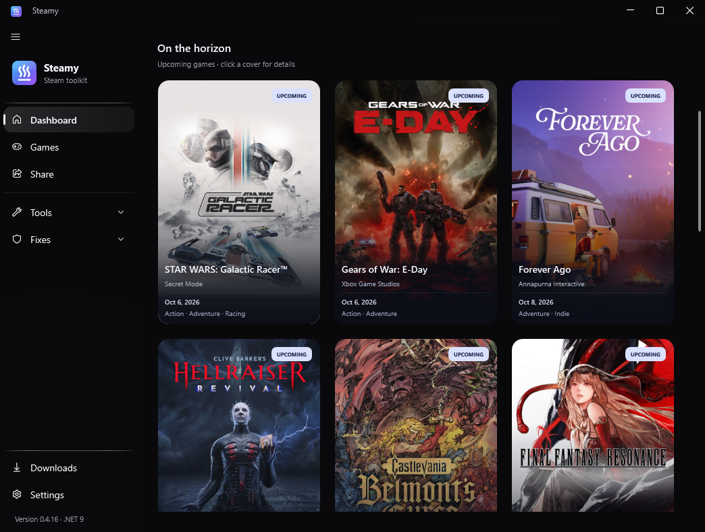
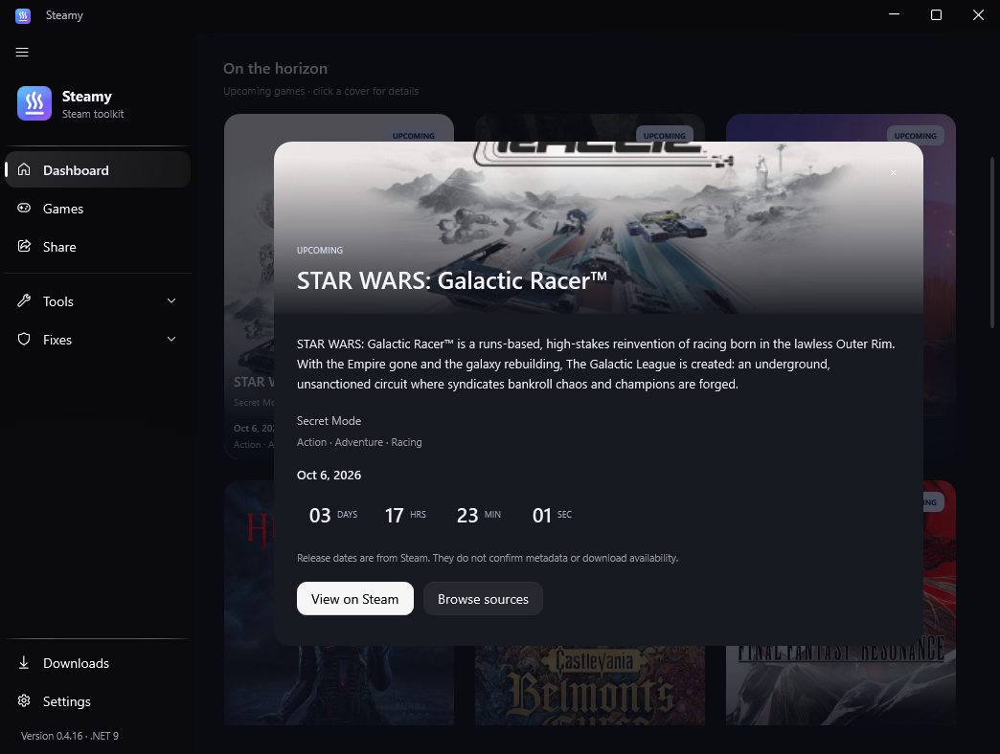
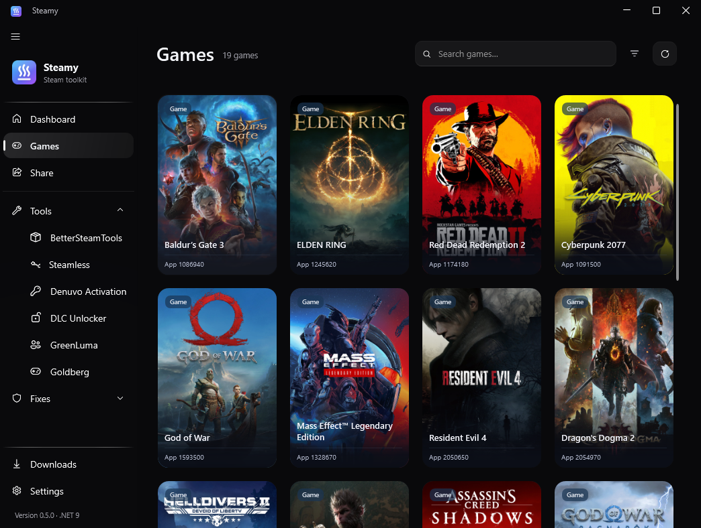
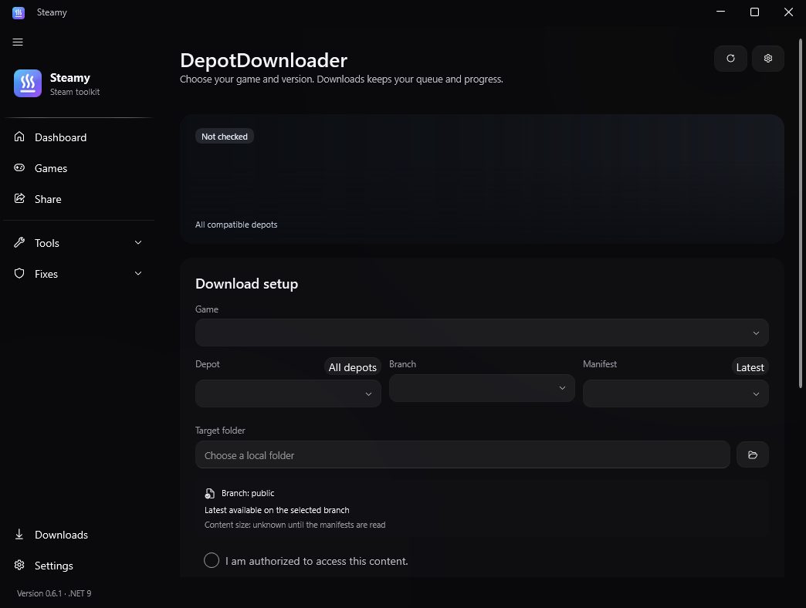
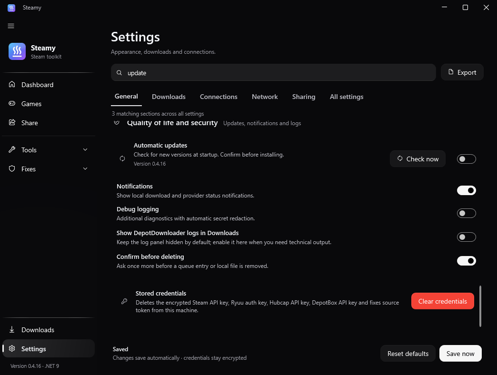
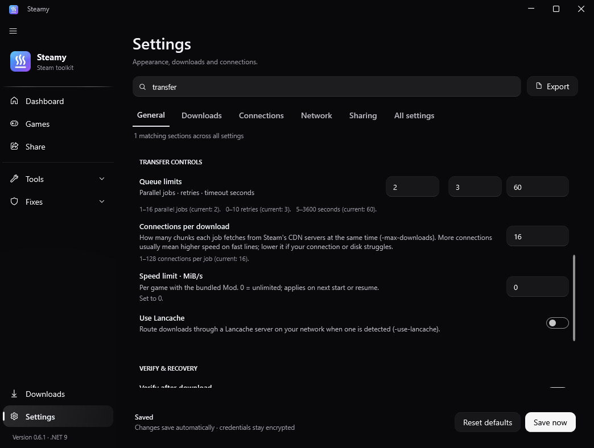
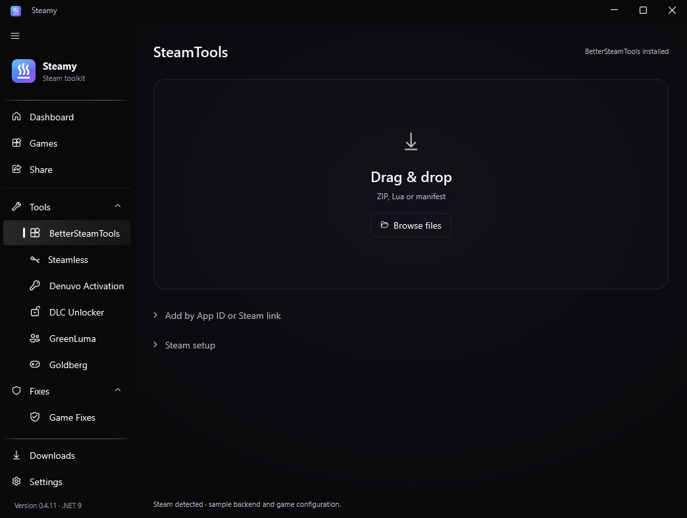

<p align="center">
  
</p>

<h1 align="center">Steamy</h1>
<p align="center"><strong>Your Steam library, downloads and tools.</strong><br/>A portable Windows app for playing, browsing and managing your games.</p>

<p align="center">
  <a href="https://github.com/ZazaJr24/Steamy/releases/latest"></a>
  <a href="https://github.com/ZazaJr24/Steamy/actions/workflows/ci.yml"></a>
</p>
<p align="center">
  <a href="https://github.com/ZazaJr24/Steamy/releases"></a>
  <a href="https://github.com/ZazaJr24/Steamy/stargazers"></a>
  <a href="https://github.com/ZazaJr24/Steamy/forks"></a>
  <a href="https://github.com/ZazaJr24/Steamy/releases/latest"></a>
</p>
<p align="center"><a href="#start-playing">Get started</a> · <a href="#inside-steamy">Features</a> · <a href="#a-closer-look">Screenshots</a> · <a href="#build-it-yourself">Build</a> · <a href="#credits">Credits</a></p>

<p align="center"></p>

## Start playing

1. **[Download Latest](https://github.com/ZazaJr24/Steamy/releases/latest)** and extract the entire ZIP into a folder.
2. Run **Steamy.exe**. Steam library folders are detected automatically; adjust them in **Settings** if needed.
3. Open **Games** to browse, or **Downloads** at the bottom left to continue your queue.

The release is portable and includes the Windows runtime. Use Windows 10 or 11 on a 64-bit PC; no separate .NET installation is needed. Keep the bundled `Tools` folder beside the app.

Already using Steamy? Open **Settings → Check now** to get the latest release. If an older build (including 0.4.12) reports GitHub HTTP 403, download and extract the latest ZIP once; 0.5.0 includes a public release-manifest fallback and checks the published SHA-256 before installing. The app can also check automatically at startup. [Release notes](CHANGELOG.md) live in one place, so this page stays focused on the app.

Normal releases use three version numbers, such as **0.6.0**. Optional hotfixes use four, such as **0.6.0.1**; Steamy retains the revision and detects newer hotfixes as well as the next regular release. The release page provides one versioned app ZIP and its SHA-256 checksum directly in the release notes.

## Inside Steamy

| Your next stop | What you'll find |
| --- | --- |
| **Dashboard** | Spotlight artwork, a flat animated countdown and wide upcoming covers, and clickable game details. |
| **Spotlight** | Upcoming major studio releases, automatically refreshed from public Steam metadata. Official artwork, publisher, release status and dates; a local cache works offline. |
| **Games** | Larger portrait covers, up to five per row, released games only, typo-tolerant title/App ID search, sorting and source filters. |
| **Downloads** | Wide game artwork with clear transfer size, speed and remaining time. Details separate active time, reused content and installation size. Compact queue with priority, pause, resume, retry and repair. Unknown measurements stay unknown. |
| **Settings** | Searchable categories, dark/light themes, reduced effects, Windows backdrop options, download limits, network options and source connections. |
| **Share** | Scan local Lua files and manifests, preview a pack, export an archive or upload to your own GitHub repository. |
| **Fixes** | Browse your configured fixes repository. **Hypervisor Fixes is Coming soon** and does not install anything yet. |

Games shows larger portrait covers, with five columns in wide windows and four in smaller desktop windows. Dashboard uses three wide landscape covers per row, with titles and dates beneath the image; Games covers are capped at 210 px. The refreshed feed currently includes 16 confirmed upcoming titles, including Modern Warfare 4, Phantom Blade Zero and Star Wars: Galactic Racer. These headline games lead the Dashboard gallery. The feed refreshes daily and the app checks it every six hours; released titles leave Dashboard. Established AAA series appear before the long tail in the default sort. The first catalog view skips the fuzzy-search index, public artwork paths are resolved in one cached Steam request per visible page, and optional providers load after the cached catalog is displayed. “On the horizon” lives exclusively in Dashboard. Games shows released titles only; coming-soon titles are excluded from search and source filters. Unknown release status is checked in the cached Steam metadata batch before showing a cover. Click a coming game for its publisher, description, genres and release information. Galleries appear with a calm fade; cards lift gently on hover while their clickable area stays fixed. Game details open over a frozen, blurred background. **Settings → General → Reduce effects** turns off optional motion, gallery blur and desktop transparency; the app also follows Windows animation preferences.

### A Spotlight that keeps moving

The feed checks public Steam data daily for upcoming releases from established publishers and studios. DLC, demos, soundtracks, old editions and expired upcoming dates are excluded. Released AAA games appear in Games; Dashboard contains upcoming releases only. Confirmed near dates come first; vague dates follow. The app checks for updates every six hours and retains its last valid feed when a request fails.

Official artwork is preloaded. Slides change about every five seconds while the app is active; **Pause / Resume**, manual arrows give you control. A small rotating indicator precedes each slide change when motion is enabled. The Spotlight countdown sits at the bottom left beside **Details**. Click any discovery cover for description, publisher, genres and release information; **View on Steam** opens the official store and **Browse sources** explicitly opens the source picker. Countdown and image updates retain your scroll position. Exact release dates show remaining days and **Today** on the date; month/year or unknown dates show **TBA**. Steam’s published full-date schedules show days, hours, minutes and seconds in a single flat horizontal strip, updated every second. Changed digits slide gently into place when animation is enabled; reduced effects disable that movement. Missing schedules retain honest date-only labels. A date reaching zero never proves that a game has released or is downloadable.

Dashboard search is hidden by default. Enable **Settings → General → Dashboard search** to search Discover. Disabling it clears the hidden query and results. The regular **Games** search is always available.

### Downloads you can come back to

Open a game, choose **Download**, and follow three steps in the compact dialog:

1. **Source** — choose a provider and load its available depot metadata.
2. **Depots & version** — all depots supplied by your source appear in a scrollable list. Tick the depots on the right and choose a source-provided manifest version. Available Steam names, platforms, languages and DLC/shared content labels appear alongside them. Optional Steam details are read through a bounded, cached SteamCMD app-info mirror request. Sizes and branch/build information are used only for an exact manifest match; missing details stay unknown. Each depot has a SteamDB inspection link.
3. **Location** — review your selection, game folder and free drive space. **Download** saves the job before opening Downloads, where the transfer continues.

Pausing retains existing files and the exact selected depot manifests. Resume uses that saved selection without asking a provider for newer versions. Missing or corrupt saved data produces a clear error; **New selection** starts an explicit new setup. Duplicate jobs targeting the same folder are rejected.

Waiting jobs can be reordered or prioritized; **Start queue** respects the selected parallel limit and existing running jobs. Transfer controls are in **Settings → Downloads**, including parallel jobs, connections and the Mod speed limit. The device-wide Network activity card is removed. The bundled Mod supports a real **MiB/s limit per game**, shared across its parallel HTTP connections and applied at start/resume. Standard or custom unpatched tools do not receive that option.

**Tools → DepotDownloader** previews the selected game and summarizes the depot, branch and manifest before adding it to the queue. **Latest** follows the selected branch; choosing an imported manifest explicitly pins that version. Reopening setup preserves the choice. A missing or mismatched manifest blocks enqueueing until you choose a valid version or deliberately select Latest. Downloader status is marked checked only after the configured tool passes its actual check.

**Verify & repair** asks DepotDownloader to check and repair the files. The separate **local file check** reports what is already on disk. Queue actions show errors in the app, and waiting jobs are checked again before they start.

Sources include **Sushi, Zaza, Ryuu, Hubcap, DepotBox and ManifestHub**, where supported. Sushi and Zaza can be browsed without an API key; other providers may require their own credentials. Source filters help narrow the catalog and queue. Availability is checked for the selected game.

### Bring your own metadata

Choose **Source → Your package** and select or drop a ZIP or Lua file. Lua is read as metadata and never executed. The importer supports depot keys, manifests and **Share → Save as ZIP** packages; from multi-game bundles it imports only the selected game. It checks Steamy hashes and rejects unsafe paths, duplicate filenames, ambiguous games and oversized archives.

Preparation creates an independent copy. Moving, editing or deleting the original package cannot change the prepared selection or its later Resume. Downloads offers a **Local** source filter. Resume locks the original source and keeps your selected manifest versions.

**Share → Save as ZIP** exports metadata, not the game files. Each game has a file list and SHA-256 hashes. The result reports the actual exported count and names games omitted because no manifests were available. Missing files produce an error. Cancellation and errors preserve an existing destination ZIP; the finished package replaces it atomically.

### Add game metadata to Steam

Open **Tools → BetterSteamTools**. The minimal workspace focuses on one large **Drag & drop** area. Drop ZIP, 7z, RAR, Lua or manifest files, or use **Browse files**. App ID/source options and Steam setup stay in compact, collapsible sections; status and Cancel remain visible while scrolling.

1. Expand **Steam setup** to choose a Steam folder, install/update the official [BetterSteamTools](https://github.com/madoiscool/BetterSteamTools) backend or start Steam. Setup opens automatically if the backend is missing or damaged. Close Steam before installation. The downloaded archive and installed payload are verified against SHA-256 checksums; three matching filenames alone do not mean installed.
2. Expand **Add by App ID or Steam link**, enter a game and click **Add to Steam**. **Automatic** tries available Sushi, Zaza and configured API sources; Hubcap, Ryuu and DepotBox use their existing Settings credentials. Availability depends on the selected provider. DepotBox accepts ZIP packages and Lua attachments, including its binary MIME type and standard function-existence guards; HTML verification pages are reported as provider errors. A prefilled game from Games details reveals these controls automatically.
3. Dropping files, choosing files or adding an App ID installs a missing backend first, verifies it and then imports the metadata. An installation error or cancellation stops the import. Leave App ID empty to detect games from metadata; an explicit ID selects a game in a multi-game bundle. Standalone manifests are cached without inventing an App ID. The Games source picker also has an **Add game** action: it opens BetterSteamTools and starts the same installation/source/import sequence when Steam is detected.

Lua is validated as `addappid`/`setManifestid` configuration and is never evaluated by Steamy. Lua goes to Steam's `config/stplug-in`; manifests go to its root `depotcache`. The existing backend configuration keeps its other paths/settings and registers the Lua folder for reload. Originals are retained under `config/steamy-backups`; failed writes restore previous files. Adding metadata does not download the game files or prove source availability for every title.

This workflow is inspired by [LuaTools](https://github.com/madoiscool/LuaTools). BetterSteamTools is downloaded on request; neither it nor LuaTools is bundled with Steamy.

<details>
<summary><strong>Tools, in one place</strong></summary>

| Tool | Purpose |
| --- | --- |
| **DepotDownloader / Steamy DepotDownloaderMod** | Depot downloads, saved manifests, queue management and repair. The verified Steamy GPL fork is downloaded from the GitHub release during first-run setup. |
| **BetterSteamTools** | Detect Steam, install/update the official backend, drop ZIP/7z/RAR archives containing Lua and manifests, or add an App ID/store link through automatic Sushi/Zaza/API source detection. |
| **Steamless** | Run Steamless against a selected executable, with its options and output in the app. |
| **Denuvo Activation** | Configure the activation tool and inspect its output; the information button links to the community help. |
| **DLC Unlocker** | Configure supported CreamAPI or SmokeAPI integration for a selected game. |
| **GreenLuma / Family Share** | Configure the supported tool and its app list. |
| **Goldberg** | Install and configure the emulator, including ColdClient mode and game-specific settings. |
| **Game Fixes** | Download fix archives from your configured repository and apply them to the selected folder. |

Additional tools are fetched when needed. Credentials are kept in a Windows DPAPI-encrypted store; settings exports exclude them.

</details>

## A closer look

Screenshots are captured from the actual Windows app using sample library, queue, depot and SteamTools status metadata. The Spotlight uses verified public Steam data. Game artwork belongs to the respective rights holders.

**Discovery** — a wide upcoming spotlight and wide upcoming covers.





**Games** — released titles only, with larger portrait covers: five per row in wide windows and four in smaller windows.


**Card hover** — a subtle highlight and motion add depth while the card's layout and clickable area stay fixed.



**Download setup** — a fully opaque source picker keeps every control readable.


**Your package** — import local ZIP or Lua metadata.


<details>
<summary>Depot/version selection and download location</summary>


</details>

**Downloads** — see what's running, what's next and what's ready to resume.




**Settings** — find a setting, then make the app yours.




**DLC selection** — installed games on the left, DLC checkboxes on the right, with a fixed action bar.


<details>
<summary>Game Fixes gallery</summary>


</details>

<details>
<summary>Hypervisor Fixes preview</summary>


</details>



### BetterSteamTools



## Build it yourself

Use the .NET SDK selected by [`global.json`](global.json). The desktop app and UI tests require Windows; the core test project also runs on Linux and macOS.

```powershell
git clone https://github.com/ZazaJr24/Steamy.git
cd Steamy
dotnet restore Steamy.sln
dotnet build Steamy.sln -c Release
dotnet test tests/Steamy.Tests/Steamy.Tests.csproj -c Release
dotnet test tests/Steamy.UiTests/Steamy.UiTests.csproj -c Release
./run.ps1
```

GitHub Actions builds Steamy's checked-in DepotDownloaderMod fork and tests `main` on Windows. The UI checks exercise the real view models, both themes, search, favorites, all download assistant stages, pause/resume, stale requests and queue persistence failures using offline test services. The screenshot workflow renders the app and updates this page's images.

<details>
<summary>Project map and automated discovery</summary>

- `src/Steamy/Pages` — pages and layouts.
- `src/Steamy/ViewModels` — UI state and commands.
- `src/Steamy/Services` — downloads, catalogs, storage, sharing and updates.
- `src/Steamy/Controls` — grid, artwork, scrolling and motion.
- `tests/Steamy.Tests` — core and download policy tests.
- `tests/Steamy.UiTests` — Windows layout and interaction tests.
- `tools/DepotDownloaderMod` — complete maintained GPL fork source, build script and tests.
- `scripts/update_spotlight.py` — public Steam metadata → discovery feed; no API key or extra Python packages.
- `.github/workflows/spotlight.yml` — daily discovery refresh, also runnable manually.

Publish a release by updating the app version and [`CHANGELOG.md`](CHANGELOG.md), then pushing a matching tag. Each release uploads only its versioned app ZIP. Its SHA-256 checksum is appended to the release notes after the ZIP is built. The download button opens the latest release; GitHub provides source archives for the matching tag.

</details>

## Credits

Steamy is maintained by [ZazaJr24](https://github.com/ZazaJr24). Thanks to the authors whose work powers its tools and sources.

| Project | Creator / community | Used for |
| --- | --- | --- |
| [Steamy DepotDownloaderMod](tools/DepotDownloaderMod) | Steamy maintainers, derived from SteamAutoCracks and SteamRE | Downloaded on first-run setup from the matching GitHub release; full [source, provenance, build and tests](tools/DepotDownloaderMod) included |
| [DepotDownloader](https://github.com/SteamRE/DepotDownloader) | SteamRE | Standard depot downloader |
| [SushiTools games repository](https://github.com/sushi-dev55/sushitools-games-repo) | [sushi-dev55](https://github.com/sushi-dev55) · [SushiTools server](https://discord.gg/sushitools) | Free Lua metadata and depot manifests, used under MIT |
| [BetterSteamTools](https://github.com/madoiscool/BetterSteamTools) | madoiscool / OpenSteamTool contributors | Optional Steam backend; official releases downloaded on request, GPL-3.0 |
| [LuaTools](https://github.com/madoiscool/LuaTools) | madoiscool / contributors | Steam metadata workflow reference, MIT; not bundled |
| [Steamless](https://github.com/atom0s/Steamless) | atom0s | Steamless engine |
| [CreamInstaller](https://github.com/FroggMaster/CreamInstaller) | FroggMaster and original CreamAPI authors | CreamAPI components |
| [SmokeAPI](https://github.com/acidicoala/SmokeAPI) | acidicoala | Optional DLC integration |
| [Goldberg / gbe_fork](https://github.com/Detanup01/gbe_fork) | Detanup01 and contributors | Steam emulator |
| GreenLuma | Steam006 | Family Share tooling |
| [WPF-UI](https://github.com/lepoco/wpfui) | lepo.co | Windows UI framework |
| [CommunityToolkit.Mvvm](https://github.com/CommunityToolkit/dotnet) | .NET Foundation and contributors | View models |

Steam store metadata and game artwork are provided by Steam and the respective publishers. Steamy is an independent project.

## License

Steamy's own code uses the [Steamy License](LICENSE). Sharing and forking are welcome; rebranding or commercial redistribution requires permission. Third-party components retain their own terms: see [THIRD-PARTY-NOTICES.md](THIRD-PARTY-NOTICES.md). Both documents are included in each release.
