<p align="center">
  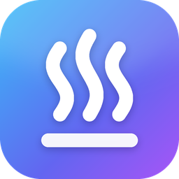
</p>

<h1 align="center">Steamy</h1>
<p align="center"><strong>Your Steam library, downloads and tools.</strong><br/>A portable Windows app for playing, browsing and managing your games.</p>

<p align="center">
  <a href="https://github.com/ZazaJr24/Steamy/releases/latest/download/Steamy-latest.zip"></a>
  <a href="https://github.com/ZazaJr24/Steamy/actions/workflows/ci.yml"></a>
</p>
<p align="center"><a href="#start-playing">Get started</a> · <a href="#inside-steamy">Features</a> · <a href="#a-closer-look">Screenshots</a> · <a href="#build-it-yourself">Build</a> · <a href="#credits">Credits</a></p>

<p align="center">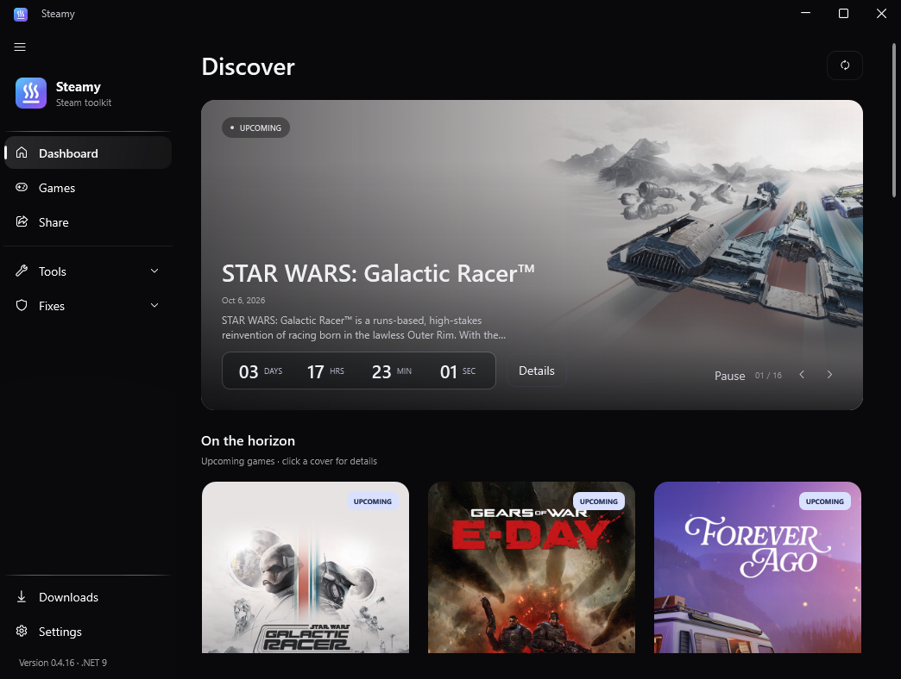</p>

## Start playing

1. **[Download Latest](https://github.com/ZazaJr24/Steamy/releases/latest/download/Steamy-latest.zip)** and extract the entire ZIP into a folder.
2. Run **Steamy.exe**. Steam library folders are detected automatically; adjust them in **Settings** if needed.
3. Open **Games** to browse, or **Downloads** at the bottom left to continue your queue.

The release is portable and includes the Windows runtime. Use Windows 10 or 11 on a 64-bit PC; no separate .NET installation is needed. Keep the bundled `Tools` folder beside the app.

Already using Steamy? Open **Settings → Check now** to get the latest release. The app can also check automatically at startup. [Release notes](CHANGELOG.md) live in one place, so this page stays focused on the app.

## Inside Steamy

| Your next stop | What you'll find |
| --- | --- |
| **Dashboard** | Large Spotlight artwork, clear download actions and at most three upcoming games in a focused discovery view. |
| **Spotlight** | Upcoming major studio releases, automatically refreshed from public Steam metadata. Official artwork, publisher, release status and dates; a local cache works offline. |
| **Games** | Rounded cover artwork with transparent captions, typo-tolerant title/App ID search, favorites, sorting and source filters. |
| **Downloads** | Compact source → depots & version → location steps, right-hand depot selection and available Steam details, plus queue priority, pause, resume and repair. |
| **Settings** | Searchable categories, dark/light themes, reduced effects, Windows backdrop options, download limits, network options and source connections. |
| **Share** | Scan local Lua files and manifests, preview a pack, export an archive or upload to your own GitHub repository. |
| **Fixes** | Browse your configured fixes repository. **Hypervisor Fixes is Coming soon** and does not install anything yet. |

Cards respond with short hover and click transitions while their clickable area stays fixed. Game details open over a frozen, blurred background. **Settings → General → Reduce effects** turns off optional motion, gallery blur and desktop transparency; the app also follows Windows animation preferences.

### A Spotlight that keeps moving

The feed checks public Steam data daily for upcoming releases from established publishers and studios. Released games, DLC, demos, soundtracks, old editions and expired release dates are excluded. Confirmed near dates come first; vague dates follow. The app checks for updates every six hours and retains its last valid feed when a request fails.

Official artwork is preloaded. Slides change about every five seconds while the app is active; **Pause / Resume**, manual arrows and artwork previews on wider windows give you control. The Spotlight countdown sits at the bottom left beside **Check sources** and **View game**. Countdown and image updates retain your scroll position. Exact release dates show remaining days and **Today** on the date; month/year or unknown dates show **TBA**. Hours, minutes and seconds require a confirmed time. A date reaching zero never proves that a game has released or is downloadable.

Dashboard search is hidden by default. Enable **Settings → General → Dashboard search** to search Discover. Disabling it clears the hidden query and results. The regular **Games** search is always available.

### Downloads you can come back to

Open a game, choose **Download**, and follow three steps in the compact dialog:

1. **Source** — choose a provider and load its available depot metadata.
2. **Depots & version** — all depots supplied by your source appear in a scrollable list. Tick the depots on the right and choose a source-provided manifest version. Available Steam names, platforms, languages and DLC/shared content labels appear alongside them. Optional Steam details are read through a bounded, cached SteamCMD app-info mirror request. Sizes and branch/build information are used only for an exact manifest match; missing details stay unknown. Each depot has a SteamDB inspection link.
3. **Location** — review your selection, game folder and free drive space. **Download** saves the job before opening Downloads, where the transfer continues.

Pausing retains existing files and the exact selected depot manifests. Resume uses that saved selection without asking a provider for newer versions. Missing or corrupt saved data produces a clear error; **New selection** starts an explicit new setup. Duplicate jobs targeting the same folder are rejected.

Waiting jobs can be reordered or prioritized; **Start queue** respects the selected parallel limit and existing running jobs. Transfer controls are directly on Downloads. The bundled Mod supports a real **MiB/s limit per game**, shared across its parallel HTTP connections and applied at start/resume. Standard or custom unpatched tools do not receive that option.

**Verify & repair** asks DepotDownloader to check and repair the files. The separate **local file check** reports what is already on disk. Queue actions show errors in the app, and waiting jobs are checked again before they start.

Sources include **Sushi, Zaza, Ryuu, Hubcap, DepotBox and ManifestHub**, where supported. Sushi and Zaza can be browsed without an API key; other providers may require their own credentials. Source filters help narrow the catalog and queue. Availability is checked for the selected game.

### Bring your own metadata

Choose **Source → Your package** and select or drop a ZIP or Lua file. Lua is read as metadata and never executed. The importer supports depot keys, manifests and **Share → Save as ZIP** packages; from multi-game bundles it imports only the selected game. It checks Steamy hashes and rejects unsafe paths, duplicate filenames, ambiguous games and oversized archives.

Preparation creates an independent copy. Moving, editing or deleting the original package cannot change the prepared selection or its later Resume. Downloads offers a **Local** source filter. Resume locks the original source and keeps your selected manifest versions.

**Share → Save as ZIP** exports metadata, not the game files. Each game has a file list and SHA-256 hashes. The result reports the actual exported count and names games omitted because no manifests were available. Missing files produce an error. Cancellation and errors preserve an existing destination ZIP; the finished package replaces it atomically.

<details>
<summary><strong>Tools, in one place</strong></summary>

| Tool | Purpose |
| --- | --- |
| **DepotDownloader / DepotDownloaderMod** | Depot downloads, saved manifests, queue management and repair. The existing Mod fork is bundled. |
| **Steamless** | Run Steamless against a selected executable, with its options and output in the app. |
| **Denuvo Activation** | Configure the activation tool and inspect its output; the information button links to the community help. |
| **DLC Unlocker** | Configure supported CreamAPI or SmokeAPI integration for a selected game. |
| **GreenLuma / Family Share** | Configure the supported tool and its app list. |
| **Goldberg** | Install and configure the emulator, including ColdClient mode and game-specific settings. |
| **Game Fixes** | Download fix archives from your configured repository and apply them to the selected folder. |

Additional tools are fetched when needed. Credentials are kept in a Windows DPAPI-encrypted store; settings exports exclude them.

</details>

## A closer look

Screenshots are captured from the actual Windows app using sample library, queue and depot metadata. The Spotlight uses verified public Steam data. Game artwork belongs to the respective rights holders.

**Games** — cover art, clear labels and room to breathe.

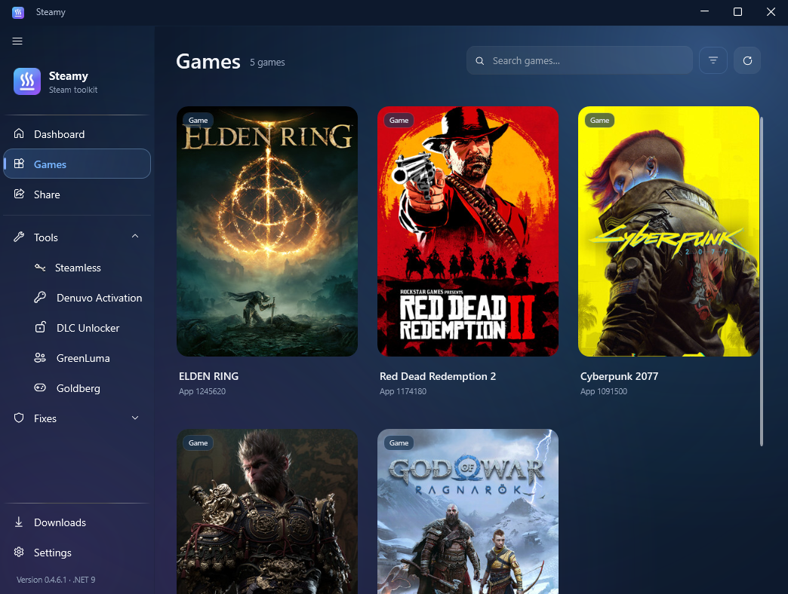

**Download setup** — begin with the familiar compact source picker.

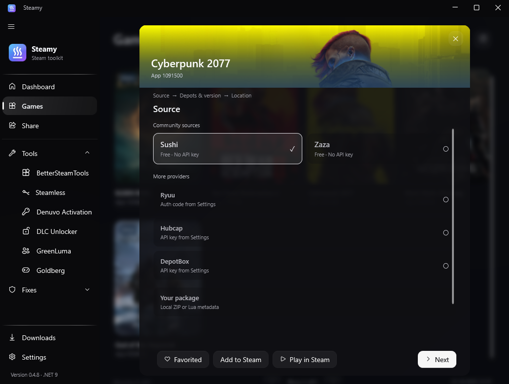

**Your package** — import local ZIP or Lua metadata.

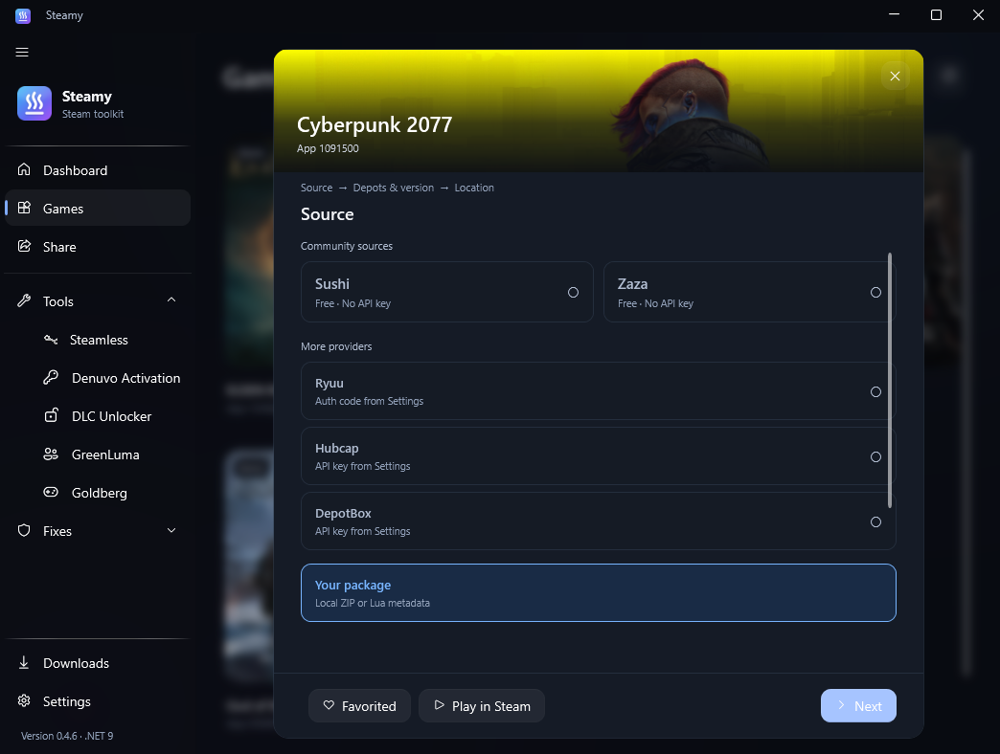

<details>
<summary>Depot/version selection and download location</summary>

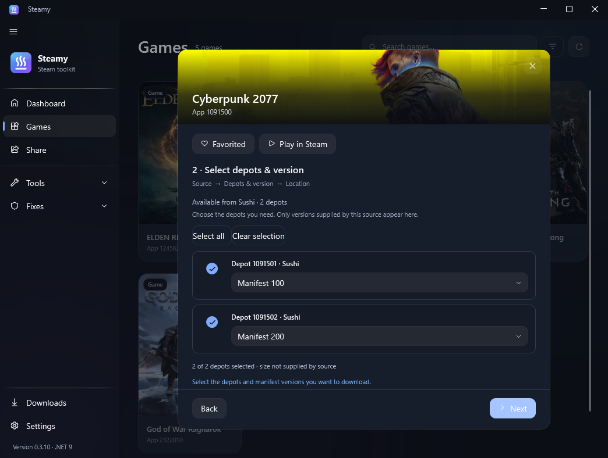

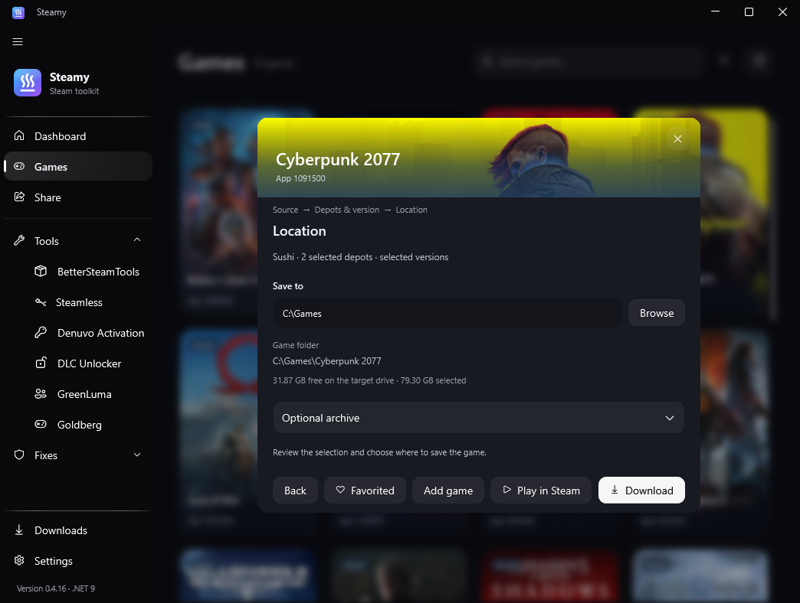

</details>

**Downloads** — see what's running, what's next and what's ready to resume.

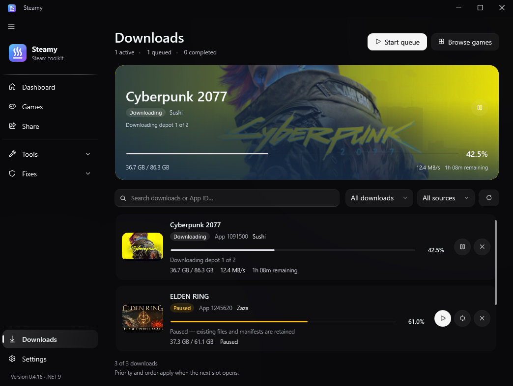

**Settings** — find a setting, then make the app yours.

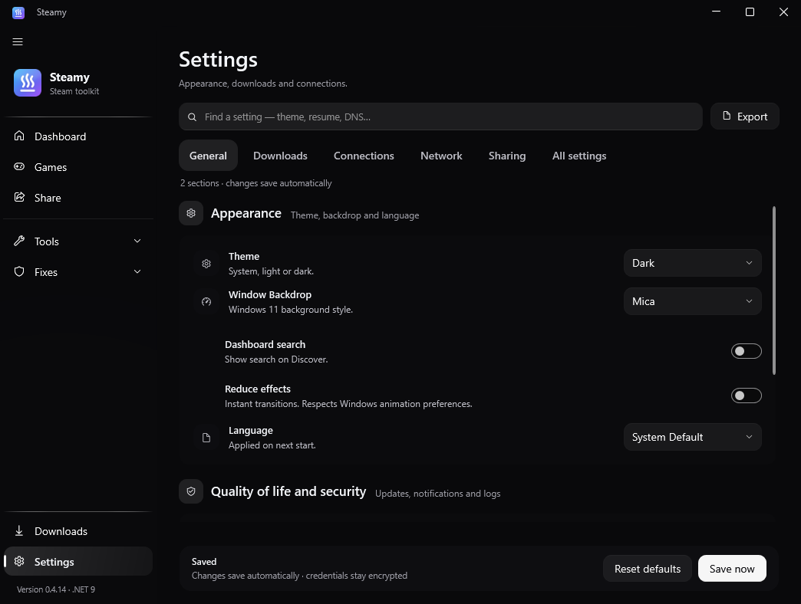

**DLC selection** — installed games on the left, DLC checkboxes on the right, with a fixed action bar.

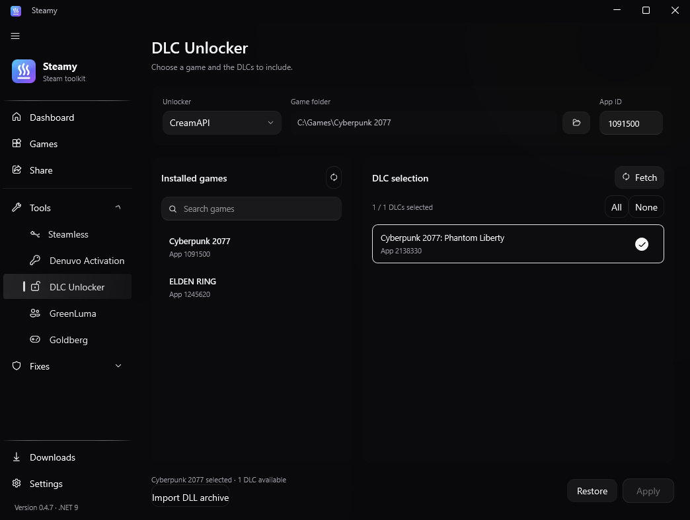

<details>
<summary>Game Fixes gallery</summary>

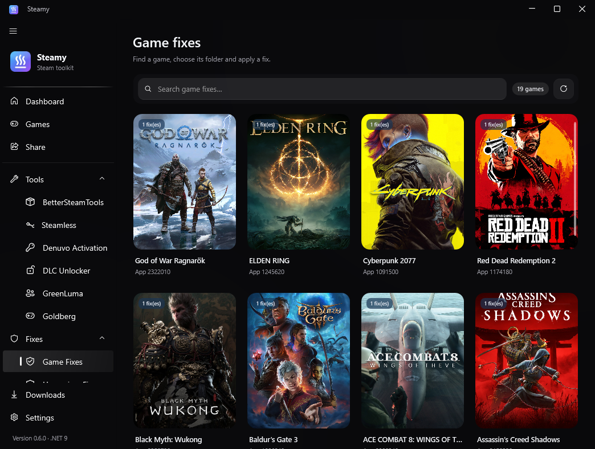

</details>

<details>
<summary>Hypervisor Fixes preview</summary>

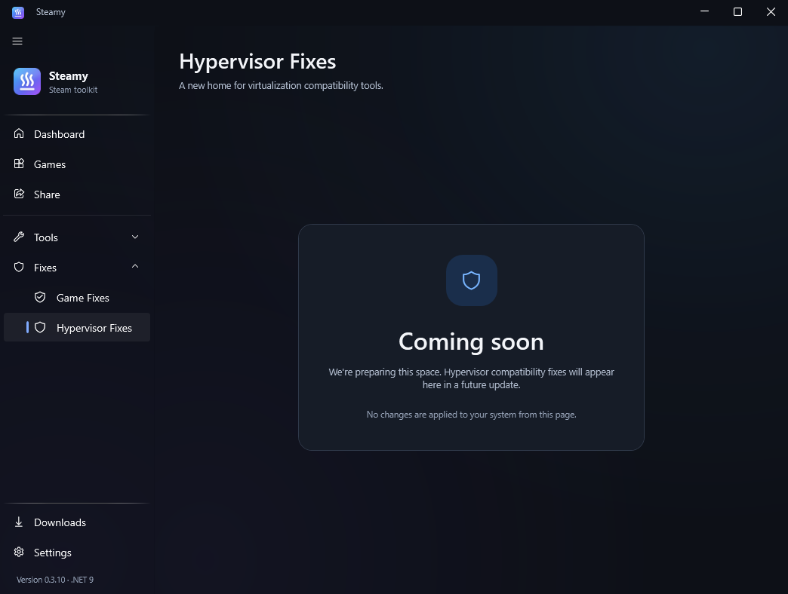

</details>

## Build it yourself

Use the .NET SDK selected by [`global.json`](global.json). The desktop app and UI tests require Windows; the core test project also runs on Linux and macOS.

```powershell
git clone https://github.com/ZazaJr24/Steamy.git
cd Steamy
dotnet restore Steamy.sln
dotnet build Steamy.sln -c Release
dotnet test tests/Steamy.Tests/Steamy.Tests.csproj -c Release
dotnet test tests/Steamy.UiTests/Steamy.UiTests.csproj -c Release
./run.ps1
```

GitHub Actions rebuilds the pinned Mod tool and builds/tests `main` on Windows. The UI checks exercise the real view models, both themes, search, favorites, all download assistant stages, pause/resume, stale requests and queue persistence failures using offline test services. The screenshot workflow renders the app and updates this page's images.

<details>
<summary>Project map and automated discovery</summary>

- `src/Steamy/Pages` — pages and layouts.
- `src/Steamy/ViewModels` — UI state and commands.
- `src/Steamy/Services` — downloads, catalogs, storage, sharing and updates.
- `src/Steamy/Controls` — grid, artwork, scrolling and motion.
- `tests/Steamy.Tests` — core and download policy tests.
- `tests/Steamy.UiTests` — Windows layout and interaction tests.
- `tools/DepotDownloaderMod` — pinned fork patch, build script and shared rate limiter tests.
- `scripts/update_spotlight.py` — public Steam metadata → discovery feed; no API key or extra Python packages.
- `.github/workflows/spotlight.yml` — daily discovery refresh, also runnable manually.

Publish a release by updating the app version and [`CHANGELOG.md`](CHANGELOG.md), then pushing a matching tag. Each release includes a versioned archive, complete source ZIP, SHA-256 checksums and **Steamy-latest.zip**, keeping the download button above current.

</details>

## Credits

Steamy is maintained by [ZazaJr24](https://github.com/ZazaJr24). Thanks to the authors whose work powers its tools and sources.

| Project | Creator / community | Used for |
| --- | --- | --- |
| [DepotDownloaderMod](https://github.com/SteamAutoCracks/DepotDownloaderMod) | SteamAutoCracks and SteamRE contributors | Bundled Mod downloader; [pinned patch, build and tests](tools/DepotDownloaderMod), GPL license and complete corresponding source included |
| [DepotDownloader](https://github.com/SteamRE/DepotDownloader) | SteamRE | Standard depot downloader |
| [SushiTools games repository](https://github.com/sushi-dev55/sushitools-games-repo) | [sushi-dev55](https://github.com/sushi-dev55) · [SushiTools server](https://discord.gg/sushitools) | Free Lua metadata and depot manifests, used under MIT |
| [Steamless](https://github.com/atom0s/Steamless) | atom0s | Steamless engine |
| [CreamInstaller](https://github.com/FroggMaster/CreamInstaller) | FroggMaster and original CreamAPI authors | CreamAPI components |
| [SmokeAPI](https://github.com/acidicoala/SmokeAPI) | acidicoala | Optional DLC integration |
| [Goldberg / gbe_fork](https://github.com/Detanup01/gbe_fork) | Detanup01 and contributors | Steam emulator |
| GreenLuma | Steam006 | Family Share tooling |
| [WPF-UI](https://github.com/lepoco/wpfui) | lepo.co | Windows UI framework |
| [CommunityToolkit.Mvvm](https://github.com/CommunityToolkit/dotnet) | .NET Foundation and contributors | View models |

Steam store metadata and game artwork are provided by Steam and the respective publishers. Steamy is an independent project.

## License

Steamy's own code uses the [Steamy License](LICENSE). Sharing and forking are welcome; rebranding or commercial redistribution requires permission. Third-party components retain their own terms: see [THIRD-PARTY-NOTICES.md](THIRD-PARTY-NOTICES.md). Both documents are included in each release.
