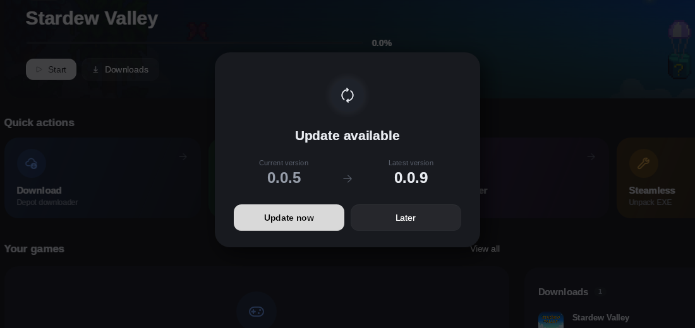

<p align="center">
  <a href="https://github.com/ZazaJr24/Steamy/releases"></a>
  &nbsp;
  <a href="https://github.com/ZazaJr24/Steamy/stargazers"></a>
  &nbsp;
  <a href="https://github.com/ZazaJr24/Steamy/releases"></a>
  &nbsp;
  <a href="LICENSE"></a>
</p>

<p align="center">
  
  
  
  
</p>

<h1 align="center">
  <br/>
  Steamy
  <br/>
</h1>

<h3 align="center">
  The only Steam modding toolkit you'll ever need.
</h3>

<p align="center">
  <em>One app. Every tool. Zero bloat.</em>
</p>

<p align="center">
  <a href="https://github.com/ZazaJr24/Steamy/releases/latest"><b>Download Latest</b></a>&nbsp;&nbsp;&bull;&nbsp;&nbsp;<a href="#-tools">Features</a>&nbsp;&nbsp;&bull;&nbsp;&nbsp;<a href="#%EF%B8%8F-build-from-source">Build</a>&nbsp;&nbsp;&bull;&nbsp;&nbsp;<a href="#-credits">Credits</a>
</p>

---

<br/>

## What is Steamy?

Steamy replaces your folder full of scattered `.exe` files, batch scripts, and half-working tools with **one clean, modern desktop app**. Built with Fluent Design, it looks and feels like it belongs on Windows 11 — dark mode, Mica backdrop, smooth animations.

Every tool is wired up, configured, and ready to go. No command lines. No README hunting. No "which version do I need?"

<p align="center">
  
</p>

<br/>

## ✨ What's new in 0.2.4

- **API keys are stored as you type** — no more "No API key stored" while the key sits in the box, and **Test connection** always checks the key you just entered
- **Clearer key errors** — the test shows the API's own message (e.g. "Invalid API key") instead of a bare HTTP code
- **Hubcap and DepotBox actually work** — the Lua parser was dropping every depot because both services write a third argument on `setManifestid`, and DepotBox now uses its one-request `/api/direct-download` package that already contains the Lua plus all depot manifests
- **No more locked Start button** — an availability check that cannot reach the API says "you can still try" instead of "not available", and a missing key names the exact Settings section
- **Sharp covers everywhere** — the cached bitmap that made game art blurry on scaled displays is gone
- **Settings looks like the Dashboard** — aurora header, icon section headers, hover cards and staggered fade-ins, plus a DepotBox test connection with your live request counts
- **DepotBox API key check** — new **Test connection** button next to the key, using the free DepotBox stats endpoints

Full list in the [**CHANGELOG**](CHANGELOG.md).

<br/>

---

<br/>

## 🔧 Tools

<br/>

<details>
<summary><strong>⚡ Steamless</strong> — Remove Steam DRM</summary>
<br/>

Strip Steam DRM stubs from game executables. All plugins are bundled and ship with the app — works instantly without downloading anything extra.

- Supports all known Steam stub variants
- Bundled CLI with automatic plugin loading
- One-click process with status feedback

</details>

<details>
<summary><strong>🔑 Denuvo Activation</strong> — Fetch activation tickets</summary>
<br/>

Grab Denuvo activation tickets for games you own. Pick a game, fetch the ticket, write the config. Three steps. Done.

- Auto-detects installed Denuvo games
- Clean ticket retrieval workflow
- Writes config files automatically

</details>

<details>
<summary><strong>🔓 DLC Unlocker</strong> — CreamAPI + SmokeAPI</summary>
<br/>

Unlock DLCs using **CreamAPI** or **SmokeAPI** — switch between both modes with a single click.

- Auto-detects all Steam games across every library folder
- Fetches complete DLC lists with concurrent name resolution
- Deep-scans game directories for `steam_api.dll` / `steam_api64.dll`
- Select individual DLCs or unlock all
- Automatic backups with one-click restore

</details>

<details>
<summary><strong>👥 GreenLuma 2026</strong> — Family Share bypass</summary>
<br/>

Bypass Steam Family Sharing restrictions. Play shared library games without limits.

- Auto-installs from downloaded zip (password-protected archives supported)
- Generates slot-based `AppList.ini` in the correct format
- Stealth mode for reduced detection
- One-click Generate + Launch with DLLInjector
- Full uninstall with trace cleanup

</details>

<details>
<summary><strong>🎮 Goldberg Emulator</strong> — Full Steam emulator</summary>
<br/>

Complete integration of [gbe_fork](https://github.com/Detanup01/gbe_fork) — the most advanced open-source Steam emulator.

- **Auto-downloads** the latest release from GitHub
- **Normal Mode** — seamless DLL replacement
- **ColdClient Mode** — loader-based, no file replacement needed
- **Everything configurable** — DLC unlock, overlay, achievements, offline, LAN, custom Steam ID, country, language
- **Achievement support** — fetches schemas from Steam API with popup notifications
- **Defender-aware** — detects quarantined DLLs and guides you through exclusions

</details>

<br/>

---

<br/>

## 🛡️ Fixes

| | |
|---|---|
| **Game Fixes** | Browse fixes from your own fixes source (a GitHub repository) and apply them to a game folder |

<br/>

---

<br/>

## 📚 Games Library

Your entire Steam library in a responsive grid with cover art. Search, filter, sort, paginate — every game auto-detected from all Steam library folders. Smooth scrolling, no lag.

<br/>

---

<br/>

## 📥 Downloads

Full-featured download manager built in.

<p align="center">
  
</p>

- **Featured download** — a large banner on the game's art with progress, speed, time left, size and a 30-second internet speed graph
- **Up next / Recently finished** — the queue and finished downloads as clean rows with game art
- **Smooth progress** — moves in 0.1 % steps between the tool's per-file updates; several depots add up to one overall value
- **Per download** — speed, size estimate, time left and the file being written
- **Faster** — choose how many connections each download uses; Lancache support
- Pause / Resume / Cancel / Retry, clear error messages, integrity check, open in Explorer

<br/>

---

<br/>

## 🔄 Auto-Update

Steamy keeps itself up to date. At startup it asks GitHub for the latest release; if there is a newer one, a small card shows your **current** and the **latest version** — **Update now** downloads it, swaps the files and restarts. **Later** keeps you where you are.

<p align="center">
  
</p>

- Nothing breaks if an update fails — every file is rolled back
- **Settings › Check now** looks for updates any time; the startup check can be switched off

<br/>

---

<br/>

## ⚙️ Settings

| | |
|---|---|
| **Window** | Mica or Acrylic backdrop |
| **Theme** | Dark / Light |
| **Language** | Per-tool configuration |
| **Network** | HTTP proxy support |
| **Sources** | Multiple manifest providers |
| **Downloads** | Parallel jobs, retries, connections per download, Lancache |
| **Updates** | Automatic update check, Check now |
| **Security** | DPAPI-encrypted API key storage |

<br/>

---

<br/>

## 🏗️ Tech Stack

| | |
|---|---|
| **Runtime** | .NET 8 (Windows Desktop) |
| **UI** | [WPF-UI 4.2](https://github.com/lepoco/wpfui) — Fluent Design, Mica/Acrylic |
| **Pattern** | MVVM — [CommunityToolkit.Mvvm](https://github.com/CommunityToolkit/dotnet) |
| **DI** | Microsoft.Extensions.DependencyInjection |
| **Compression** | SharpCompress 0.39 — 7z, zip, rar |
| **Security** | Windows DPAPI encrypted credential store |

<br/>

---

<br/>

## ⬇️ Download

Grab the latest release from the [**Releases**](https://github.com/ZazaJr24/Steamy/releases) page.

> **Requirements:** Windows 10/11. Nothing else — the release ZIP brings everything it needs.
> From version 0.1.1 on, Steamy updates itself.

<br/>

---

<br/>

## 🛠️ Build from Source

```powershell
git clone https://github.com/ZazaJr24/Steamy.git
cd Steamy
dotnet build src/Steamy/Steamy.csproj -c Release
```

> Output: `src/Steamy/bin/Release/net8.0-windows/Steamy.exe`

**Releasing a new version**

1. Add a `## x.y.z` section at the top of [`CHANGELOG.md`](CHANGELOG.md) — it becomes the release notes
2. Set the version in `src/Steamy/Steamy.csproj`
3. Push a tag `vx.y.z` — GitHub Actions builds the ZIP and publishes the release, and every installed Steamy offers the update

<br/>

---

<br/>

## 📁 Project Structure

```
src/Steamy/
├── Pages/           UI pages — Dashboard, Games, Tools, Settings
├── ViewModels/      MVVM ViewModels
├── Services/        Core logic — downloads, updater, CreamAPI, Goldberg, ...
├── Models/          Data models and enums
├── Views/           Update card
├── Controls/        Custom controls — SmoothProgressBar, AdaptiveGridPanel, ...
├── Resources/       Styles, themes, bundled DLLs
└── Tools/           Bundled Steamless CLI + plugins
```

<br/>

---

<br/>

## 🙏 Credits

| Project | Author | Used for |
|---|---|---|
| [Steamless](https://github.com/atom0s/Steamless) | atom0s | DRM removal engine |
| [CreamInstaller](https://github.com/FroggMaster/CreamInstaller) | FroggMaster | CreamAPI DLLs (v5.3.0.0) |
| [SmokeAPI](https://github.com/acidicoala/SmokeAPI) | acidicoala | Alternative DLC unlocker |
| [Goldberg Emulator](https://github.com/Detanup01/gbe_fork) | Detanup01 | Steam emulation (gbe_fork) |
| [GreenLuma 2026](https://cs.rin.ru) | Steam006 | Family Share bypass |
| [WPF-UI](https://github.com/lepoco/wpfui) | lepo.co | Fluent Design framework |

<br/>

## 📄 License

Steamy's own code is released under the [Steamy License](LICENSE).
Sharing and forking are welcome; rebranding or commercial redistribution requires permission.
Bundled third-party components keep their own licenses and are not covered by it — see
[THIRD-PARTY-NOTICES.md](THIRD-PARTY-NOTICES.md). Both files are included in every release ZIP.

<br/>

---

<br/>

<p align="center">
  <strong>Steamy</strong><br/>
  <sub>No bloat. No telemetry. No nonsense.</sub><br/><br/>
  
</p>
